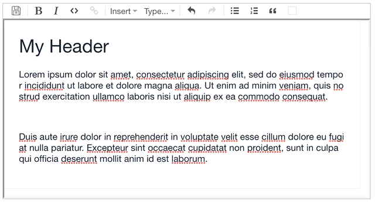

# (drag and) Drop Image upload for Prosemirror

File upload by dragging the images onto the [Prosemirror](https://prosemirror.net) editor. No upload form, no hassle. Accepts svg, png, jpg and gif. 



Usage: 
```js
const {imageDropHandler} = require('prosemirror-dropimage')

...
let state = EditorState.create({
  doc: DOMParser.fromSchema(myschema).parse(document.querySelector("#content")),
  plugins: [
    ...
    imageDropHandler(myschema,'/api/fileupload'),
    ...
  ],
})
```

The second parameter is the upload endpoint, processes multipart/form-data file uploads and returns 200 and image URL in body.

No tests (not normal from me, I know). Pull requests and (even) issues are welcome.
